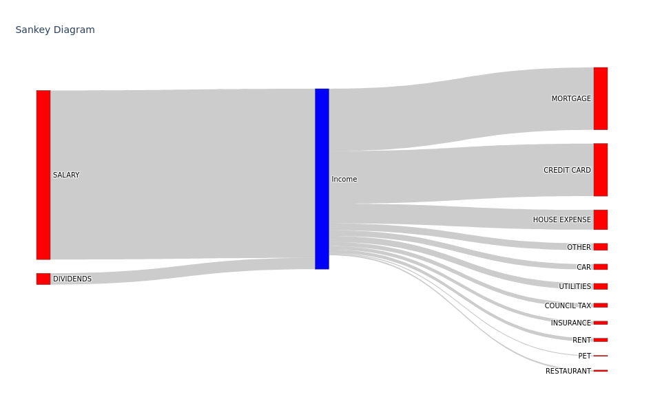

# GENERATE A BUDGET SANKEY DIAGRAM WITH PYTHON

## Objective

An experiment in generating a sankey diagram using sample budget data in csv format

## How to run 

pipenv shell

python main.py

## Example output
